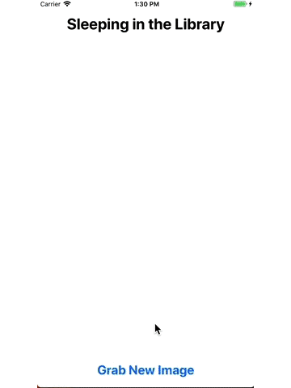

## Overview

The application SleepingInTheLibray will fetch the images of people sleeping in the library from Flickr. The application uses [Carthage](https://github.com/Carthage/Carthage) as a dependency package manager.

## Demo

